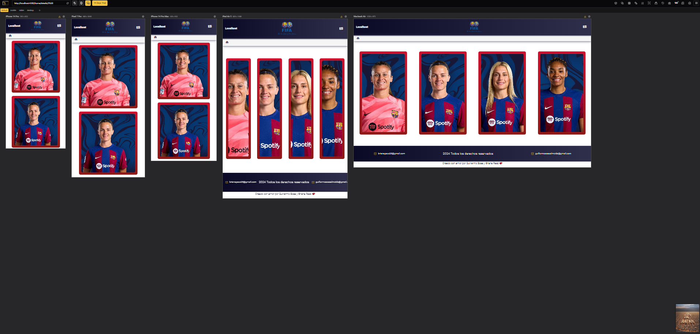
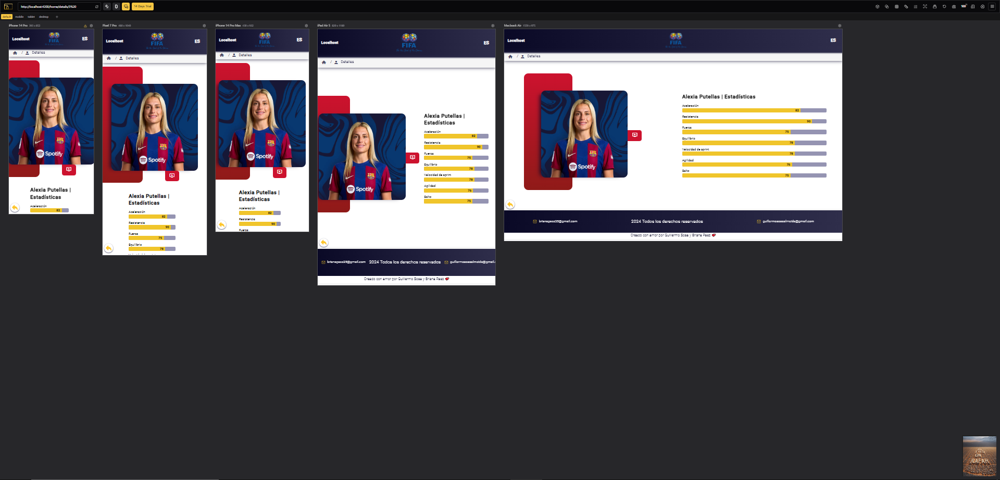
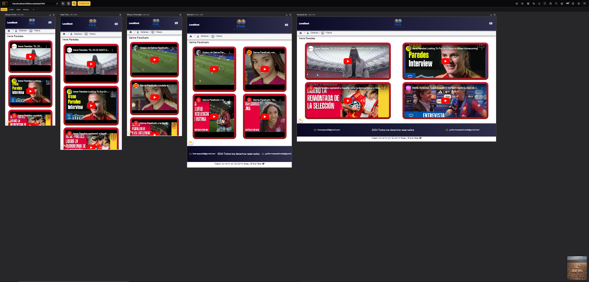

# FIFA Exam

FIFA Exam is an Angular-based project designed to check the skills of 4 players. It utilizes Angular Material for UI components and NGX-Translate for internationalization support, making it a modern, responsive, and multi-lingual web application.

## Getting Started

To get a local copy up and running follow these simple steps.

### Prerequisites

- Node.js
- npm

```bash
npm install npm@latest -g
```

### Development server

Run `ng serve --open` for a dev server. The application will automatically reload if you change any of the source files.

### Build

Run `ng build` to build the project. The build artifacts will be stored in the `dist/` directory.

## Project Structure

The project follows a modular architecture, organized primarily into the following directories and files:

- `src/`: Contains the source code of the project.
  - `app/`: The core directory for Angular components, services, and modules.
    - `classes/`: The class is used to model the data structures and encapsulate the business logic of the application.
    - `components/`: Houses reusable UI components like buttons, headers, and footers.
    - `config/`: Centralizes the translator config service for all files.
    - `contracts/`: Houses interface definitions and type declarations that establish clear communication protocols between different components of the application.
    - `models/`: Defines the data models and interfaces used throughout the project.
    - `pages/`: Comprises the application's pages or views, each representing a distinct part of the user interface.
    - `services/`: Contains Angular services for handling business logic, API calls, and state management.
    - `shared/`: This module houses header and footer component to improve consistency in design and functionality, reducing code duplication and promoting maintainability.
  - `assets/`: Stores static files such as images, fonts, and external libraries.
  - `environments/`: Contains configuration files for different environments (e.g., development, production).
- `dist/`: The output directory for the build artifacts, generated after running the build command.
- `node_modules/`: Includes all the npm packages and dependencies required by the project.

## Services

The project leverages several key services to enhance its functionality and performance:

### `getCardInfo()`

- **Purpose**: Retrieves an array of `CardInfo` objects, each representing a player's card information.
- **Returns**: `Observable<CardInfo[]>` - An observable stream of player card information.

### `getPlayerById(id: number)`

- **Purpose**: Fetches a single `Player` object based on a provided player ID.
- **Parameters**: `id` - The unique identifier of the player.
- **Returns**: `Observable<Player>` - An observable containing the requested player data.

### `private getFilePlayers()`

- **Purpose**: Internally used to decrypt and fetch player data from a file.
- **Returns**: `Observable<Player[]>` - An observable stream of decrypted player data.

## Angular Material

Provides a comprehensive suite of UI components that follow Material Design principles, ensuring a consistent and modern user interface.

## NGX-Translate

Offers internationalization support, enabling the application to be easily translated into multiple languages, thus catering to a global audience.

## Responsiveness

Here is an example of the different responsive views of the application:

### Home page



### Details page



### Videos page



## ESLint and Prettier

ESLint is a tool for identifying and reporting on patterns found in ECMAScript/JavaScript code, with the goal of making code more consistent and avoiding bugs. It can also enforce coding styles to maintain code quality.

Prettier is a code formatter that ensures consistent code style by parsing your code and re-printing it with its own rules. It helps eliminate debates over code formatting and enforces a consistent style across your codebase.
